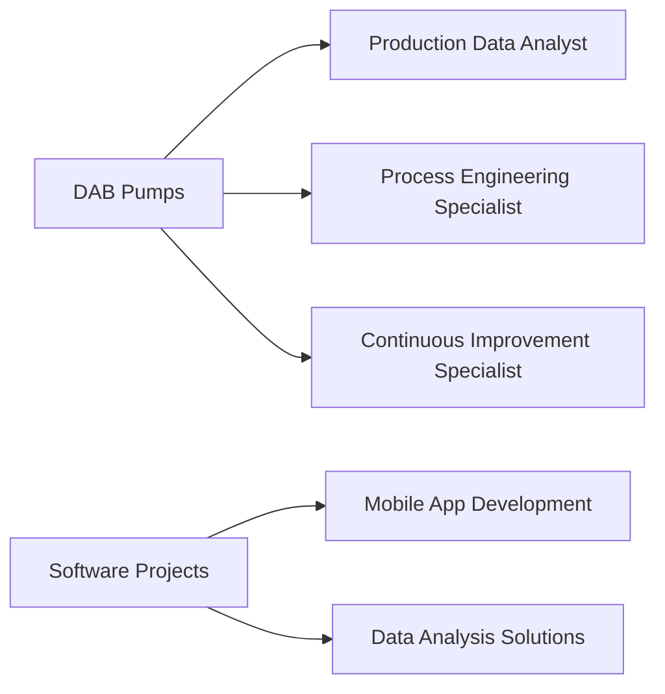

<h1 align="center">
  
</h1>

<p align="center">
  <a href="https://www.linkedin.com/in/mert-yandimata/"></a>
  <a href="https://www.instagram.com/myandimata/"></a>
  <a href="mailto:myandimata4@gmail.com"></a>
</p>

<pre align="center">
  <code>
  1 0 1 0 1 0 1 0 1 0 1 0 1 0 1 0 1 0 1 0 1 0 1 0 1 0 1 0 1 0 1 0
  0 ________  ___  _____ ______   ________  ________  ___       1
  1 |\   ___ \|\  \|\   _ \  _   \|\   __  \|\   __  \|\  \      0
  0 \ \  \_|\ \ \  \ \  \\\__\ \  \ \  \|\  \ \  \|\  \ \  \     1
  1  \ \  \ \\ \ \  \ \  \\|__| \  \ \   __  \ \   _  _\ \  \    0
  0   \ \  \_\\ \ \  \ \  \    \ \  \ \  \ \  \ \  \\  \\ \  \   1
  1    \ \_______\ \__\ \__\    \ \__\ \__\ \__\ \__\\ _\\ \__\  0
  0     \|_______|\|__|\|__|     \|__|\|__|\|__|\|__|\|__|\|__|  1
  1 0 1 0 1 0 1 0 1 0 1 0 1 0 1 0 1 0 1 0 1 0 1 0 1 0 1 0 1 0 1 0
  </code>
</pre>

## 👨‍💻 About Me

```python
class DataAnalystSoftwareEngineerAndAppDeveloper:
    def __init__(self):
        self.name = "Mert Yandımata"
        self.roles = ["Data Analyst", "Software Engineer", "Mobile App Developer"]
        self.languages = ["tr_TR", "en_US", "it_IT"]
        self.current_work = "Production Data Analyst at DAB Pumps"
        self.education = "Master's in Management Engineering, Università degli Studi di Padova"

    def say_hi(self):
        print("Hello! Welcome to my profile. Let's explore the world of data, craft innovative software, and create cutting-edge mobile apps!")

me = DataAnalystSoftwareEngineerAndAppDeveloper()
me.say_hi()
```

I'm a multifaceted professional with expertise in data analysis, software engineering, and mobile app development. Currently leveraging data-driven insights to optimize production processes at DAB Pumps, while also pursuing innovative software and mobile app projects.

## 🚀 Skills & Technologies

<p align="center">
  
  
  
  
  
</p>

## 💼 Professional Experience



- **Production Data Analyst** at DAB Pumps (2023 - Present)
- **Process Engineering Specialist** at DAB Pumps (2023)
- **Continuous Improvement Specialist** at DAB Pumps (2022 - 2023)

## 🎓 Education

- 🏛 **Master's in Management Engineering**
  Università degli Studi di Padova (2021-2024)
- 🏭 **Bachelor's in Industrial Engineering**
  Yaşar University (2015-2020)
- 💻 **Bachelor's in Software Engineering (ICT)**
  Yaşar University (2017-2021)
- 🧠 **Minor in Psychology**
  Yaşar University (2018-2021)

## 📱 Mobile Applications

<p align="center">
  <a href="https://apps.apple.com/us/app/your-app1"></a>
  <a href="https://apps.apple.com/us/app/your-app2"></a>
  <a href="https://apps.apple.com/us/app/your-app3"></a>
</p>

## 📊 GitHub Stats

<p align="center">
  
</p>

<p align="center">
  
</p>

## 📫 Get in Touch

<p align="center">
  <a href="mailto:myandimata4@gmail.com"></a>
  <a href="https://www.linkedin.com/in/mert-yandimata/"></a>
  <a href="https://www.instagram.com/myandimata/"></a>
</p>

<pre align="center">
  <code>
  0 1 0 1 0 1 0 1 0 1 0 1 0 1 0 1 0 1 0 1 0 1 0 1 0 1 0 1 0 1 0 1
  1        Thank you for visiting my GitHub profile!        0
  0 1 0 1 0 1 0 1 0 1 0 1 0 1 0 1 0 1 0 1 0 1 0 1 0 1 0 1 0 1 0 1
  </code>
</pre>
